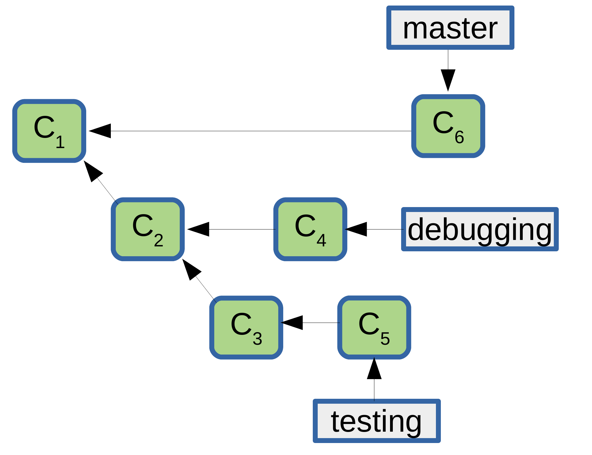

# Quiz on Git

## What you should do:

1. Create a branch with your name and commit your changes to it.
2. **To check the correct answers**: edit the README document and replace the ``- [ ]`` with ``- [x]`` to mark the correct answers.

Question 1
----------
After you initialize a new Git repository and create a file named ``my_file.txt``, which of the following commands will not work if issued?

- [ ] git status
- [ ] git add .
- [ ] git commit -m "my_file.txt is added"
- [ ] git add my_file.txt

Question 2
----------
Say you have three changed files (``README.md``, ``my_code.py`` and ``my_page.html``) that are not staged yet. You want **only** to commit the changes of the file ``my_page.html``, you'll perform the following:

- [ ] execute the following commands:

    1. git add .
    2. git commit -m "added the file my_page.html"

- [ ] execute the following commands:

    1. git add my_page.html
    2. git commit -m "my commit message"

- [ ] execute the following commands:

    1. git add my_page.html
    2. git commit -m "added the file my_page.html"

Question 3
----------

Which command should you use to initialize a new Git repository?

- [ ] git bash
- [ ] git install
- [ ] git init
- [ ] git start

Question 4
----------

Which file can you configure to ensure that certain file types are never committed to the local Git repository?

- [ ] ignore.git
- [ ] .gitignore
- [ ] gitignore.txt
- [ ] git.ignore

Question 5
----------

When you run the command ``git branch debugging``, the following will happen:

- [ ] The ``HEAD`` will point to the newly created branch named ``debugging``
- [ ] Create a new branch named ``debugging`` and you'll see the message: ``Switched to branch 'debugging'``
- [ ] Create a new branch named ``debugging`` and ``HEAD`` will stay pointing at ``master``   
- [ ] None of the above

Question 6
----------
Consider you start with an **empty** directory and you initialize a git repository. After a couple of commits and branchings you end up with the following history:

The commits C1, C2, ... are numbered in sequence, which means that the commit C1 came before the commit C2 and the commit C3 before C4. The commands that were performed to get the to this **exact history** are the following:

- [ ] After ``git init`` and the first commit C1:

      1. git checkout -b debugging
      2. modify  and commit
      3. git checkout -b testing
      4. modify  and commit
      5. git checkout debugging
      6. modify  and commit
      7. git checkout testing
      8. modify  and commit
      9. git checkout master
      10. modify  and commit

- [ ] After ``git init`` and the first commit C1:

      1. git checkout -b debugging
      2. git checkout -b testing
      3. modify  and commit
      4. modify  and commit
      5. git checkout debugging
      6. modify  and commit
      7. git checkout testing
      8. modify  and commit
      9. git checkout master
      10. modify  and commit

- [ ] After ``git init`` and the first commit C1:

      1. git checkout -b debugging
      2. git checkout -b testing
      3. modify  and commit
      4. modify  and commit
      5. modify  and commit
      6. git checkout debugging
      7. modify  and commit
      8. git checkout master
      9. modify  and commit

- [ ] After ``git init`` and the first commit C1:

      1. git checkout -b debugging
      2. modify  and commit
      3. modify  and commit
      4. git checkout -b testing
      5. modify  and commit
      6. git checkout debugging
      7. modify  and commit
      8. git checkout master
      9. modify  and commit

